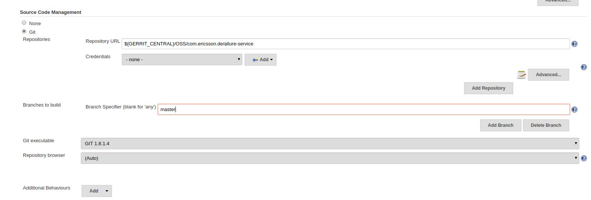
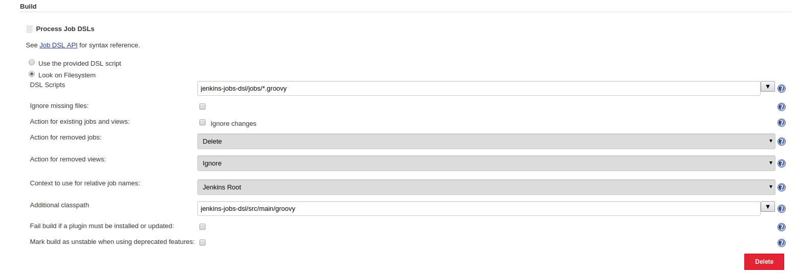

# Prerequisites

## Global Environment Variables
Note: The seed job expects some Global Environment Variables to be present on jenkins

| Name | Value |
| ------------ | ----------------------------------------------- |
| *GERRIT_CENTRAL* | ssh://gerrit.ericsson.se:29418 |
| *GERRIT_MIRROR* | ssh://gerritmirror.lmera.ericsson.se:29418 |

## Seed Job

In order to create all required jobs for "http-tool" project
 - Manually create a freestyle job, the name does not matter.
 - Edit the job configuration and scroll down the the "Source Control Management" section and enter the http-tool repo details.
 
 - Scroll down to the "Build" section and  add a "Process Job DSLs" build step
 - Select the "Look on Filesystem" option and paste "jenkins-jobs-dsl/jobs/*.groovy" in the "DSL Scripts" textbox.
 - Click on the "Advanced" button and paste "jenkins-jobs-dsl/src/main/groovy" in the "Additional classpath" textbox
 
 - Save the configuration and run the job

Once the job runs it automatically creates all the required jobs for the Test Data Management project.
